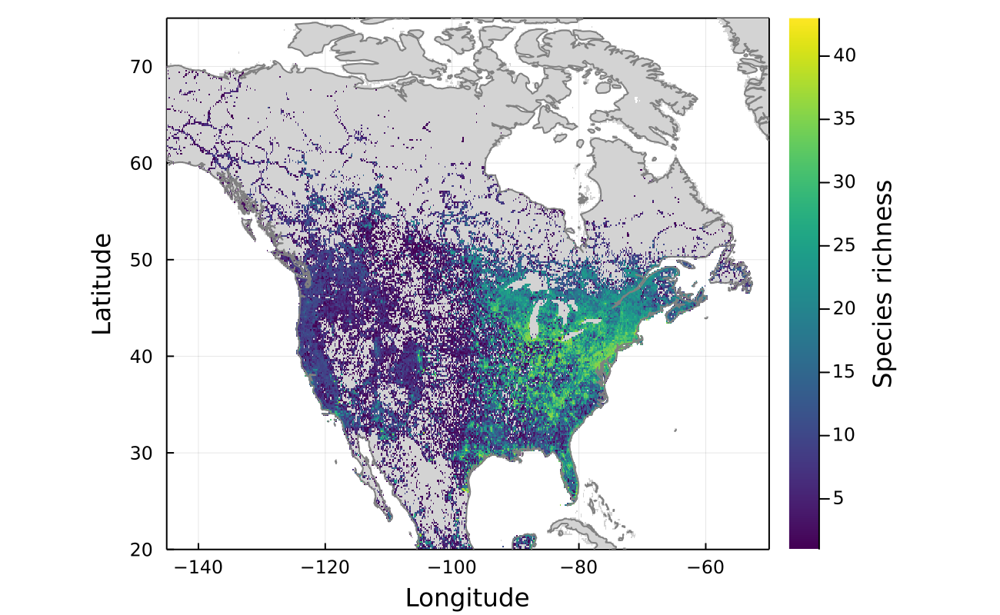
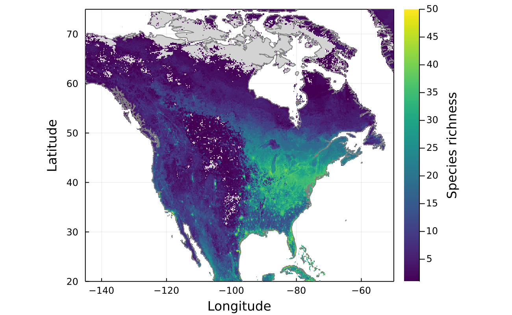
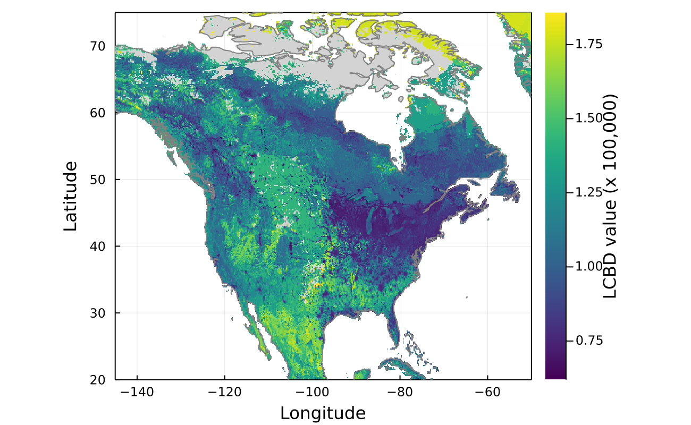

# Beta Diversity Hotspots

  

This repository contains work for my *M.Sc.*
on the identification of beta-diversity hotspots using species distribution models
(SDMs). It is based on previous proof of concept by @tpoisot, my advisor, at
<https://gitlab.com/tpoisot/BioClim>.

This project is implemented in *Julia v1.4.1*. The required packages and versions are
listed in `Project.toml`.

The data used in this project comes from the *eBird Basic Dataset*. The project is for now
focused on all warblers species (*Parulidae* family) in North America (CA, US, MX).

    eBird Basic Dataset. Version: EBD_relJun-2019. Cornell Lab of Ornithology, Ithaca, New York. Jun 2019.

Note however that neither the data is not hosted in this remote repository, due to size
limitations. More details below.

## Repository structure

The repository is organized has follows:

- `archive/` contains outdated elements kept in case of future need.

- `assets/` contains the *Worldclim 2.0* climate data (downloaded through the
  `SimpleSDMLayers` package) and the *Copernicus* land cover data (downloaded in
  `src/00c_data_landcover-copernicus.jl`)

- `data/` is used locally to store the data.
  - `jld2/` contains exported *Julia* `.jld2` elements, such as SDM predictions. As these
    are rather large, only `.zip` archives are version-controlled.
  - `proc/` contains processed CSV data.
  - `raw/` contains the raw CSV datasets from eBird (not version controlled)

- `docs/` contains documents such as reports and presentations about the project.

- `fig/` contains the figures produced, organized by outcome.

- `src/` contains all the scripts used in the project.
  Ordered scripts in this directory represent the main steps of the analyses.
  Subfolders contain scripts with a more specific use.
  - `lib/` is the library of the custom functions used.
  - `others/` contains useful scripts that are not part of the main analyses. These are
    not necessarily maintained.
  - `shell/` contains Bash scripts used for some operations.

## Analysis workflow

All analysis scripts are in `src/`.

- `master.jl` can be used to run all the analyses and produce the figures.
- `required.jl` loads all the required packages and library functions.

Else, the general workflow of the analyses is as follows:

1. `00a_preparation_ebd-extraction.jl` extracts the Warblers data from the complete
    EBD to `data/raw` (not version controlled).

1. `00b_preparation_ebd-preparation.jl` prepares the Warblers data in `data/raw` for
    for the analyses, then saves the results in `data/proc` (not version controlled)

1. `00c_preparation_landcover.jl` prepares the landcover data from
    Copernicus and exports the environmental data to CSV in `data/proc`.

1. `01_distributions` assembles species distributions from the raw data as layers and as
   a Y-matrix. It also produces examples of single species maps.

1. `02_training_random-forests.R` trains random Forest models in R (package `ranger`) based
   on the Y-matrix and environmental data CSV files.

1. `03_predictions_random-forests` applies the models on the full-scale continuous
   environmental data and arranges the predictions as layers.

1. `04_analysis.jl` performs the main analysis steps: getting species richness and
   LCBD values per site, as well as showing the relationship between the two.

1. `05_subareas.jl` investigates the effect of scale and performs the analyses on smaller
   regions.

1. `06_moving-windows.jl` computes LCBD values from subareas of smaller scales with a
   moving windows algorithm.

## Main results

### Species richness

    
    

### LCBD & relationship to richness

[bart_moving-windows]: fig/bart/06-0_bart_moving-windows_full.png

    
    

### Subareas

![Subareas - BARTs][bart_subareas]

[bart_subareas]: fig/bart/05-1_bart_subareas_combined.png

### Effect of scaling

![Effect of scaling - BARTs][bart_scaling]

[bart_scaling]: fig/bart//05-3_bart_subareas.gif

## Details on library scripts

This code is built around the `SimpleSDMLayer` types, which are used to store the
environmental variables, and also store the ouput of the prediction.

1. `analysis.jl` contains the functions to perform the main analyses.

1. `beta-div.jl` contains functions to compute beta-diversity statitstics.

1. `bioclim.jl` contains functions to perform the BIOCLIM SDM model.

1. `csvdata.jl` contains functions to prepare the data extracted from CSV files.

1. `landcover.jl` contains functions to extract and prepare the landcover data.

1. `overloads.jl` contains some utility functions to extend those from `SimpleSDMLayers`,
    notably to manipulate and integrate `DataFrames`.

1. `plotSDM.jl` contains a function to allow easier plotting of the `SimpleSDMLayer` type
    elements.

7. `presence-absence.jl` contains the function to convert the raw data into a
   presence-absence layer.

8. `shapefiles.jl` contains a function to download the shapefiles for plotting, and a
   function to clip them so that they overlap with a `SimpleSDMLayer`.

## Additional notes

- Further updates will make all data accessible and everything reproducible once a proper
  storage solution is found.
- The initial project used to download data through the `GBIF` package.
  Although some functions still support the `GBIFRecords` type, it has been abandoned in the analyses.
  Compatibility with later functions is not guaranteed.
