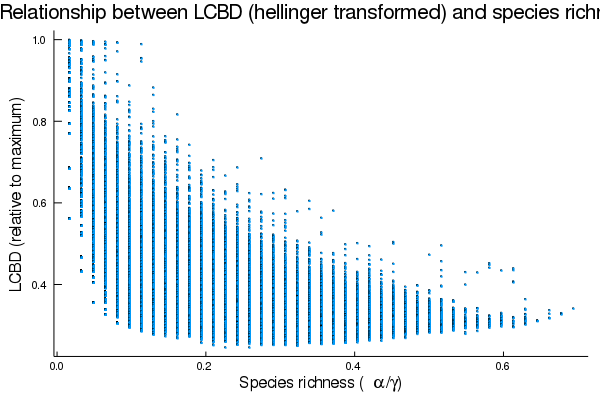
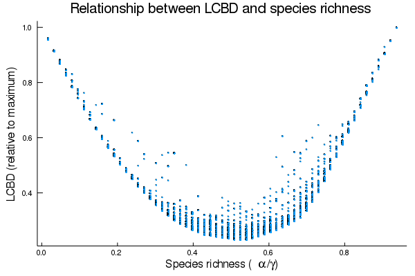

[//]: # (cd doc; pandoc -s --filter pandoc-citeproc committee-doc.md -o committee-doc.pdf)

\newpage

\begin{titlepage}
  \centering
  \Large Université de Montréal \par
  \vfill
  \LARGE \textbf{Spatially continuous identification of beta diversity hotspots using species distribution models} \par
  \vfill

  \normalsize By \par
  \Large \textbf{Gabriel Dansereau} \par
  \normalsize 20147609 \par
  \vfill

  Département de sciences biologiques \par
  Faculté des arts et des sciences \par
  \vfill

  \large Advisory Committee Meeting \par
  \vfill

  % Bottom of the page
  \normalsize \today \par
\end{titlepage}

\newpage

\tableofcontents
\listoftables
\listoffigures

\newpage

## Abstract

Beta diversity is an essential measure to describe the organization of biodiversity in
space. The calculation of local contributions to beta diversity (LCBD), specifically,
allows for the identification of sites with exceptional diversity within a region of
interest, which is useful for both community ecology and conservation purposes.
However, beta diversity implies a comparison among the sites of a given region, thus, its
use is restricted to sites with known species composition, and to discontinuous spatial
scales. We therefore propose a method to calculate LCBD indices on continuous scales for a
whole region of interest, including unsampled sites.
First, species distributions can be predicted on continuous scales using species
distribution models (SDM). These models, such as the BIOCLIM method, use the environmental
conditions at sampled sites to predict the presence or absence of each species at
unsampled locations.
Second, LCBD statistics can then be computed on the SDM predictions.
We therefore show that it is possible to identify beta diversity hotspots on spatially
continuous and extended scales.
Our results confirm that LCBD values are related to species richness, and that
species-poor sites contribute most to beta diversity.

\newpage

## Introduction

Beta diversity, defined as the variation in species composition among sites in a
geographic region of interest [@LegeBorc05], is an essential measure to describe
the organization of biodiversity in space.
Total beta diversity within a community can be partitioned into local contributions to
beta diversity (LCBD) [@LegeDeC13], which allows for the identification
of sites with exceptional species composition, hence exceptional biodiversity.
Such a method is useful for both community ecology and conservation biology, as it
highlights sites that are most important for their research or conservation values.
However, LCBD calculation methods require complete information on community composition,
such as a community composition matrix $Y$, thus they are inappropriate for partially
sampled or unsampled sites.
To our knowledge, theses methods have mostly been applied on community data from sampled
sites, hence on discontinuous spatial scales, e.g. at intervals along a river stream
[@LegeDeC13]. This raises the following questions:
1\) could LCBD indices be extended to continuous spatial scales, and 2\) could this provide
novel ecological insights in poorly sampled regions?
We aim to answer these questions by combining the LCBD calculation methods with predictive
biogeography approaches, and suggest that this would allow for the identification of sites
with high conservation value in poorly sampled regions.

Species distribution models (SDMs) already allow to make predictions on continuous spatial
scales which could be used to calculate LCBD indices.
Theses methods, also known as bioclimatic envelope models [@ArauPete12], aim
to predict species presence or absence based on observation of occurrences at known
locations [@PoisLaBr19]. This way, they generate novel ecological insights, and
represent an approach yet to be applied to LCBD. We believe that such an approach of
generating novel ecological insights for unsampled or lesser-known locations could be an
interesting new perspective in the study.
Through them, we would be able to expand community information already available, and thus
work on a much larger community matrix than in typical LCBD studies.

Appropriate data to expand measures of exceptional biodiversity through space is
increasingly available online.
For instance, the Worldclim 2.0 database [@FickHijm17] provides interpolated
climate data for global land areas at very high spatial resolution, and the eBird platform
[@SullWood09] provides a growing citizen-contributed database of worldwide bird
observations. Both of these are commonly used in SDMs, and offer relevant information on
extended spatial scales.
Hence, we believe that we could use them to predict community composition and calculate
LCBD indices on continuous spatial scales, and that the result would be representative of
the true community structure.

The predictive approach we suggest would be especially useful in poorly sampled regions,
or in regions with only sparse sampling.
While it doesn’t replace a full sampling within the community, it does provide relevant
ecological insights.
For instance, the method could help identify unsampled sites with potential conservation
value which should be targeted as soon as possible in future studies.
We also believe that our method could also be combined with IPCC climate change scenarios,
which provide projections for climate variables, in a way that would allow us to model
beta diversity changes with climate change and to identify the sites where the changes in
the community will be most important.
Again, this method would be more relevant as an informative approach to suggest sites to
prioritize for future conservation and more structured research.

In this document, we cover in more details the methods that we suggest for this research
project. The preparation part of the project, including data collection and manipulation,
has already been done, and a workflow for the analyses, including code implementation, has
been defined as well.
We also detail preliminary analyses and results intended as proof-of-concept for the
approach, which of course needs to be refined.
Finally, we discuss methods that we intend to use in future analyses, and whose
feasibility is not as clearly stated.

## Methods

### 1. Data Collection

We decided to focus our analyses on bird species and collected the data available on eBird
for the Warblers family.
The complete database contains nearly 600 million observations.
We chose to focus specifically on the Warblers family, as it is a diverse group, popular
among birders, with over 30 million observations.
Global citizen-contributed databases often present additional challenges compared to
conventional datasets due to their lack of structure, as well as spatial and taxonomic
biases [@JohnHoch19]. For instance, there was a clear bias in our data towards the United
States, where there were much more observations and sampling events (@tbl:ebird).
However, eBird offers two advantages over other large scale datasets
[@JohnHoch19]\: 1) the data is structured as checklist and users can explicitly specify
their observations as “complete checklists” when all detected species were reported, which
allows to infer information on species absences, and 2) the dataset is semi-structured and
checklists are associated with metadata describing sampling effort, such as duration of
search, distance travelled and number of observers, which can be used as controls in the
analyses. Hence, model performance can be improved by inferring absences and subsampling
checklists, while spatial bias can be compensated by including effort covariates in the
model. Therefore, we believe the dataset can be appropriately used to achieve our
objective of expanding measures of exceptional biodiversity through space.

We collected the data available in the WorldClim 2 database [@FickHijm17] for North
America, to which we decided to restrict our analyses.
The WorldClim data consists of spatially interpolated monthly climate data for global
areas, available for resolutions from 10 arc-minutes to 30 arc-seconds (around 18 km² and
1 km² at the equator).
Since the release of the first version of the database in 2005 [@HijmCame05], it became
the most common source of climate data for SDM studies [@BootNix14]. The variables we used
were different measures of temperature and precipitation(@tbl:wc_vars), and they have been
show to have very high global cross-validation coefficients (> 0.99 and 0.86 respectively)
[@FickHijm17]. We chose to use the coarser 10 arc-minutes resolution in our preliminary
analyses, as we believed it was sufficient for proof of concept of our method.
However, @HijmCame05 showed high within-grid cell variation in the 10 arc-minutes data,
and therefore recommended the use of the finer resolution, which hid less of the variation
known to the model.
Given this, we might reconsider the resolution to use in our final analyses.

We chose to restrict our analyses to North America given the high amount of data available
in eBird. We believed it represented a suitable scale for our models, large enough to
cover a lot of variation in environmental variables and community structure, as well as
phenomenons such as species migration.
We also expected such extent of the spatial scale to cover for imprecision in estimated
species ranges.

### 2. Data Manipulation

WorldClim variables and eBird occurrence data are provided in different formats, so they
required some manipulations to be combined together.
WorldClim variables are provided in a 2-dimensional grid format, useful for large scale
analyses and visualization, where each cell or pixel has a size corresponding to the
resolution of 10 arc-minutes.
Each of the 19 variables forms a different grid.
On the other hand, eBird records are occurrence-based, so each entry in the dataset
corresponds to an observation of a single species at a given time and location.
These entries can easily be matched to the 2D grid format of the WorldClim variables
through their spatial coordinates, which we found more useful for large scale analyses and
visualization.
Hence, for each species, we matched all occurrences in eBird to the grid format of the
WorldClim variables, and then created a presence-absence community matrix $Y$, taking all
the grid cells as sites.
At the 10 arc-minutes resolution, we obtained 39 024 sites with occurrences and 62
species in total.
All data manipulations and further analyses were realized in *Julia v1.2.0* [@BezaEdel17]
with the basic structure built around the soon-to-be-released `SimpleSDMLayers.jl` package.

### 3. SDM – The BIOCLIM Method

We used the BIOCLIM method [@Nix86] to predict species distributions, which is a
climate-envelope model, considered a classic in the field, that simply relates a species
distribution to the ranges of bioclimatic variables at observed locations
[@BootNix14]. It has long been outperformed by other methods [@ElitGrah06], but it is still
commonly used for its simplistic approach and ease of understanding, as well as its simple
relation to niche theory [@BootNix14; @HijmPhil17]. It is also a method designed for
presence-only data, which does not require information on absences, nor take them into
account if provided (as in our case).
Despite that, we chose this method for our preliminary analyses as it was easier to
implement and because we believe it to be sufficient for proof-of-concept.
We discuss possible alternatives in the “Alternative Methods” section below.

Briefly, the BIOCLIM method defines species potential range as a multidimensional
environmental hypervolume bounded by the minimum and maximum values of all presences
[@Fran10a]. For each species, the algorithm establishes the percentile distribution of the
values of each environmental variables at the known locations of occurrences
[@HijmPhil17]. All sites are then compared to those percentile distributions and given a
score for each variable according to their ranking between 0.0 (1st percentile) and 1.0
(100th percentile).
The median or 50th percentile is considered as the most suitable location, and both tails
(e.g. 10th and 90th percentile) are not distinguished, the values larger than 0.5 being
subtracted from 1. The minimum percentile score across all environmental variables is
selected as the prediction value for each site and multiplied by 2 so values are between 0
and 1 [@HijmPhil17]. It should be noted that the limiting variable is thus not necessarily
the same for all sites.
Values of 1 are rare, as it would mean a perfectly median site on all variables, and
values of 0 are frequent, since they are assigned whenever an environmental value is
outside the range of the observed ones [@HijmPhil17]. Finally, before calculating richness
or beta diversity metrics, we transformed the predictions back to a presence-absence
format, where all predictions greater than one are considered as presence.
This might tend to overestimate species ranges and create some sort of border effect, but
we believe the effects will be mitigated given the spatial extent and coarse scale of our
study.

### 4. LCBD Calculation

We calculated the LCBD statistics through the total variance of the matrix $Y$ for both
the raw data and SDM predictions.
@LegeDeC13 showed that LCBD coefficients can be calculated directly through the total
variance of matrix $Y$, or through a matrix of dissimilarities among sampling units.
We chose the first approach as it also allows to compute species contributions to beta
diversity (SCBD), which could also prove useful for conservation purposes, but we did not
investigate these for now.
Before computing the LCBD statistics, the presence-absence matrix $Y$ had to be
transformed in an appropriate way [@LegeDeC13]. We chose to apply the Hellinger
transformation to the raw data and no transformation on the SDM predictions for now,
although we did not investigate these in detail.
The most appropriate transformation still needs to be determined, especially for the SDM
predictions. We then computed a matrix $S$ of squared deviations from column means and
summed all the values of $S$ to obtain the total sum of squares ($SS$) of the species
composition data [@LegeDeC13]. LCBD coefficients are then computed as $LCBD*i = SS_i/SS*{Total}$,
where $SS_i$ is the sum of squares of a sampling unit $i$. Finally, since our matrix $Y$
is very large, the LCBD coefficients are very small, so we scaled them to the maximum
value observed.

### 5. Prediction Validity

The exact way of testing the validity of the predictions remains to be determined, and
will also depend on the exact methods used to make the SDM predictions.
A key element to note is that both SDM predictions and LCBD values will have to be
validated, hence they might require different methods.
Metrics that measure the accuracy of categorical or probabilistic predictions in SDMs are
well documented, in various forms.
Some require absence data to test against, and can be used on probabilistic predictions
directly (area-under-curve, AUC) or after a conversion of the predictions to binary
presence-absence using a certain threshold (Kappa index, measuring the difference between
observed and chance agreement in a confusion matrix) [@Fran10a]. Other methods are
appropriate for presence-only data, such as the Boyce Index.
In any case, measuring
prediction error is only one part of validation, and finding appropriate data for
evaluation is almost as essential [@Fran10a], especially since we also aim to describe
community structure.
Separating the data into a training and testing dataset, with 70% and 30% of the
observations for instance, is a possible approach common in machine learning methods,
although all of the available observations might be needed in some cases [@Fran10a].
An interesting approach, suggested by @ElitGrah06 for SDMs, would be to find independent,
well-structured presence-absence datasets for validation, on which both SDM predictions
and beta diversity metrics could be tested.
This approach has the advantage that the testing data is truly independent of the training
one, hence it could be used with certain tests of significance.
Although it might not cover the entire extent of the predictions in a single test, this
method brings a closer comparison to the way LCBD metrics are used in most studies, and it
would provide interesting perspectives if combined with other, full-extent validation
methods.

### 6. Alternative methods

Other methods could possibly outperform BIOCLIM for the predictions, as shown by
@ElitGrah06. Better predictions will come by two different means:
1\) approaches that are better than BIOCLIM to model the relationship between species
presence-absence (or even abundance) and environmental variables, and 2\) approaches that
account for other drivers of species distributions, such as ecological interactions and
species migration.
The most obvious alternative to BIOCLIM is MAXENT [@PhilAnde06], another presence-only
method that has come to be one of the most widely used methods.
Machine learning methods would be also be interesting alternatives that have been proven
to outperform BIOCLIM [@Fran10a]. Random Forests, especially are simple methods to
put in place, allow for quantification of the variables importance in explaining
variation, and offer intrinsic testing metrics.
Neural networks could also be an interesting alternative.
However, while those methods might return more accurate predictions, they do not
implicitly model other drivers of species distribution, among which species interactions
and functional niche.
Integrating those factors might prove more difficult given our dataset and our focus
Warblers species, as no appropriate information on their interaction is available, to our
knowledge. Joint species distribution models (JSDMs) might be an interesting way to
encompass those, as they attempt to model species co-occurrence, rather than the
distribution of single species [@PollTing14]. A different taxonomic
group and data datasets could also be used with more details on interactions could also be
used, though having a method that can be applied to any taxonomic group would be more
interesting. Yet, such an approach might prove to be beyond the scope of the present
research.

### 7. Climate Change Scenarios and Temporal Beta Diversity

We aim to apply our method to environmental conditions from climate change scenarios,
first to model community compositions after climate change on continuous scales through
SDMs, and then to identify the sites where the community has changed in the most
exceptional ways.
This can be done through LCBD values, but also through temporal beta diversity indices
(TBI) [@Lege19], which allow to study changes in community composition through time
from repeated surveys at given sites.
Whereas LCBD values essentially measure the contribution to beta diversity of each site
compared to all other ones, TBI measure changes in community composition for a single site
between two surveys, and can also be decomposed into species losses and gains.
Moreover, TBI can be tested for significance using a permutation test.
An approach similar to that of @LegeCond19 would be most interesting to
follow: they first computed LCBD indices and compared the sites that were significant for
two surveys 30 years apart, highlighting a swamp region where important changes seemed to
have occurred, and then used TBI indices to confirm the sites with significant changes,
decompose those into losses and gains and identify the species that had changed the most.
Such an approach could be highly informative with our data, although the permutation tests
and corrections to apply might cause problems given the number of sites that would be
implied in our study.
The possibility of using climate change scenarios in the SDMs also needs to be
investigated in more details.
We did not try to download nor find the appropriate data for now, but we found that the
interpolated variables are sometimes different than those used in Worldclim 2.0. The SDM
models and predictions might therefore be slightly different than those used for the LCBD
calculations, and potentially less reliable.
Nonetheless, we believe it will be possible to do some kind of time analysis linking beta
diversity, climate change and species distribution modelling, and that it could return highly
informative results for conservation purposes.

## Preliminary Results

Our preliminary results mainly consisted of comparisons between the raw occurrence data and
the SDM predictions for the four following elements:
single-species distribution ([@fig:sp_raw; @fig:sp_sdm]), species richness
([@fig:richness_raw; @fig:richness_sdm]), LCBD coefficients ([@fig:lcbd_raw;
@fig:lcbd_sdm]), and the relationship between the species richness and LCBD
coefficients ([@fig:relation_raw; @fig:relation_sdm]).
Two main results emerged from them:
1) the models provided seemingly valid and relevant results for poorly sampled regions,
both expected species-poor and species-rich ones, and 2) there was a strong association
between species richness and LCBD coefficients confirming the relationship shown in other
studies.

First, the example of the Yellow Warbler (*Setophaga petechia*), one of the most observed
species, showed that the single-species models predicted a broad distribution covering
poorly sampled areas, with notable patches of absence across the continent ([@fig:sp_raw;
@fig:sp_sdm]). Likewise, species richness, defined as the number of species present per
site, showed a clear latitude gradient, with the poorest sites to the North and the
richest to the South ([@fig:richness_raw;
@fig:richness_sdm]). A form of altitude gradient could also be observed, with the Rockies
and other mountains well delimited by their lower values.
In both cases, the results make intuitive sense and highlight the models ability to
predict species presence despite poor or no sampling.
Mexico, for example, has much sparser sampling and fewer observations, but the models
predict Yellow Warblers presence in most areas nonetheless, as well as higher species
richness than on the highly sampled Atlantic Coast, which make sense for a more southern
location. We believe these to be valid insights on poorly sampled locations, although
we reckon that intuitive reasoning is not a proof of anything, and that the model might be
wrong in important ways.
In any case, it highlights the need for an appropriate method of
validation, as well as a thoughtful consideration of other factors such as species
migration.

Second, our preliminary LCBD results seemed to confirm the association between species
richness and LCBD coefficients, while also being valid and insightful.
They were however harder to interpret given the use of the Hellinger transformation for
the raw occurrence data only.
Raw occurrence data showed a negative relationship between species richness and LCBD
coefficients (@fig:relation_raw), as observed previously by @HeinGron17, with no clear
geographic pattern (@fig:lcbd_raw).
If anything, the highest values seemed to be at the borders of the most sampled regions,
which are about where the sites with the less species observed are located
(@fig:richness_raw).
On the other hand, SDM predictions showed a quadratic form, with the LCBD coefficients
re-increasing after some threshold (@fig:relation_sdm).
The geographic pattern is also clearer, with the highest values to the northern and
southern extremes (@fig:lcbd_sdm).
We suggest that this result makes sense, as LCBD indices should highlight the most
exceptional species composition, and these are both well and continuously represented in a
SDM.
Although raw occurrence data results concorded with those of @HeinGron17, the "border
effect" and the difference with SDM projections might show the importance of going beyond
occurrence data when using large databases but spatially biased databases such as eBird.
Once again, our results highlight the need for well-thought method and an investigation of
the appropriate transformation to use on the data.

Finally, one disappointing aspect of our method is that the result failed to identify
patterns on finer scales.
The trends shown by the SDMs for both the species richness and LCBD coefficients were
large-scale, latitude-related patterns.
Except for mountains, few exceptional sites are actually shown in the middle of the
landscape. While it might have been unrealistic to expect such results from a coarse
analysis like ours, it would be useful for conservation purposes to be able the identify
precise sites within smaller regions.
This might be achieved by using a finer resolution, which we should probably reconsider,
or by using a different technique, such as training the models and predicting species
distributions on large scales, but computing and scaling LCBD values on finer local ones,
which might highlight regional differences in a new way.

\newpage

: Distribution of the data in the eBird checklists for the countries used in the analyses {#tbl:ebird}

| Country | Observations | Checklists | Species | Species per checklist (mean) | Species per checklist (median) | Species per checklist (maximum) |
|---|---|---|---|---|---|---|
| US    | 19 206 453 | 7 840 526 | 56 | 2.450 | 2.0 | 34 |
| CA    | 3 360 650  | 1 115 625 | 45 | 3.012 | 2.0 | 31 |
| MX    | 407 227    | 147 599   | 61 | 2.759 | 2.0 | 21 |
| Total | 22 974 330 | 9 103 750 | 63 | 2.523 | 2.0 | 34 |

: WorldClim 2 climate variables used in the analyses {#tbl:wc_vars}

| Variable | Description                                                |
| ------   | ------                                                     |
| 1        | Annual Mean Temperature                                    |
| 2        | Mean Diurnal Range (Mean of monthly (max temp - min temp)) |
| 3        | Isothermality (BIO2/BIO7) (* 100)                          |
| 4        | Temperature Seasonality (standard deviation *100)          |
| 5        | Max Temperature of Warmest Month                           |
| 6        | Min Temperature of Coldest Month                           |
| 7        | Temperature Annual Range (BIO5-BIO6)                       |
| 8        | Mean Temperature of Wettest Quarter                        |
| 9        | Mean Temperature of Driest Quarter                         |
| 10       | Mean Temperature of Warmest Quarter                        |
| 11       | Mean Temperature of Coldest Quarter                        |
| 12       | Annual Precipitation                                       |
| 13       | Precipitation of Wettest Month                             |
| 14       | Precipitation of Driest Month                              |
| 15       | Precipitation Seasonality (Coefficient of Variation)       |
| 16       | Precipitation of Wettest Quarter                           |
| 17       | Precipitation of Driest Quarter                            |
| 18       | Precipitation of Warmest Quarter                           |
| 19       | Precipitation of Coldest Quarter                           |

\newpage

{#fig:sp_raw}

{#fig:sp_sdm}

\newpage

{#fig:richness_raw}

{#fig:richness_sdm}

\newpage

{#fig:lcbd_raw}

{#fig:lcbd_sdm}

\newpage

{#fig:relation_raw}

{#fig:relation_sdm}

\newpage

## References

