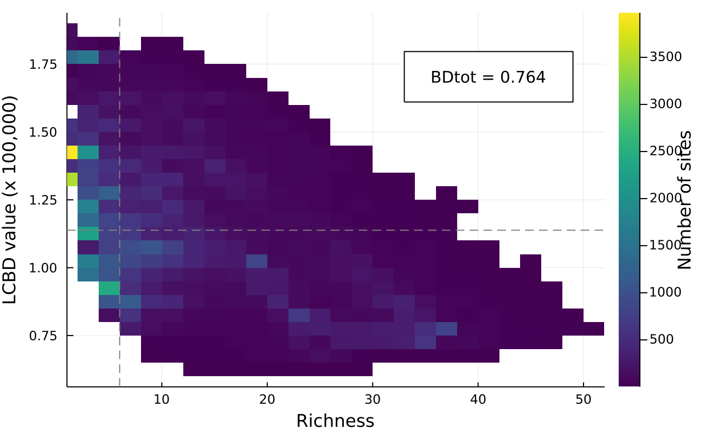

## Abstract

Beta diversity is an essential measure to describe the organization of
biodiversity in space. 
The calculation of local contributions to beta diversity (LCBD), specifically, 
allows for the identification of sites with exceptional diversity within a
region of interest, 
To this day, LCBD indices have mostly been used on regional, smaller scales with
relatively few sites.
Furthermore, as beta diversity implies a comparison among the sites of a given
region, their use is typically restricted to stricly sampled sites with known 
species composition, hence to discontinuous spatial scales.
Here, we investigate the variation of LCBD indices on extended spatial scales 
including both species poor and species rich regions, and investigate their
applicability for continuous scales and unsampled sites through the use of
species distribution models (SDMs).
To this aim, we used bayesian additive regression trees (BARTs), a method
gaining in popularity in the SDM field, to model species composition on
continuous scales based on observation data from the eBird database.
Our results highlight a changing relationship between site richness and LCBD 
values for species-poor and species-rich region depending on the extent of the 
full region of interest.
We also show that SDMs return relevant LCBD predictions displaying the same 
relationship as the one obtained with observation data only.
Hence, our method could prove useful to identify beta diversity hotspots in
unsampled locations, which could be important targets for conservation purposes.

## Figures

Distribution of species richness in North America, defined as the number of 
Warblers species per site. 
The raw occurrence observations from eBird (@fig:richness_raw) and the SDM
predictions from the BIOCLIM model (@fig:richness_sdm) were both transformed
into presence-absence data per species before calculating richness.

Distribution of the LCBD values in North America, calculated from the variance 
of the community matrix Y and scaled to the maximum value observed. 
The Hellinger transformation was applied on the raw occurrence data 
(@fig:lcbd_raw) before calculating the LCBD indices. SDM predictions
(@fig:lcbd_sdm) were converted into presence-absence data, but no transformation
was applied before calculating the LCBD indices.

Relationship between the species richness and the LCBD value of the each site 
for raw occurrence data (blue) and SDM predictions (orange). 
Species richness was calculated as the number of species in a site ($\alpha$),
divided by the total number of species ($\gamma$). LCBD values were scaled to
the maximum value observed. 
Hellinger transformation was applied on the raw occurrence data before 
calculating LCBD indices.

