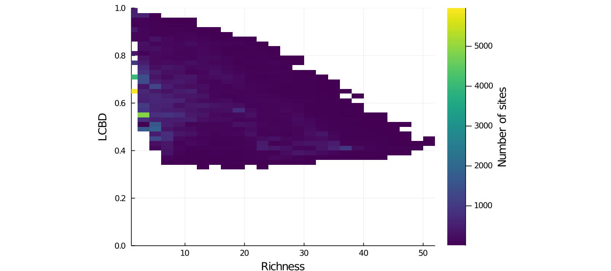

## Abstract

Beta diversity is an essential measure to describe the organization of
biodiversity in space.
The calculation of local contributions to beta diversity (LCBD), specifically,
allows for the identification of sites with exceptional diversity within a
region of interest.
To this day, LCBD indices have mostly been used on regional, smaller scales with
relatively few sites.
Furthermore, as beta diversity implies a comparison among the sites of a given
region, their use is typically restricted to strictly sampled sites with known 
species composition, hence to discontinuous spatial scales.
Here, we investigate the variation of LCBD indices on extended spatial scales
including both species-poor and species-rich regions, and investigate their
applicability for continuous scales and unsampled sites through the use of
species distribution models (SDMs).
To this aim, we used bayesian additive regression trees (BARTs) to model species
composition on continuous scales based on observation data from the eBird
database.
Our results highlight a changing relationship between site richness and LCBD
values for species-poor and species-rich region depending on the extent of the
full region of interest.
We also show that SDMs return relevant LCBD predictions displaying the same
relationship as the one obtained with observation data only.
Hence, our method could prove useful to identify beta diversity hotspots in
unsampled locations, which could be important targets for conservation purposes.

## Figures

    
    

Figure: Distribution of species richness in North America, defined as the number
of Warblers species per site (10 arc-minutes pixel).
The raw occurrence observations from eBird (left) and the SDM
predictions from the BART models (right) were both transformed
into presence-absence data per species before calculating richness.

Figure: Distribution of the LCBD values in North America, calculated from the
variance of the site-by-species community matrix Y and scaled to the maximum
value observed.
SDM predictions were converted into presence-absence data, then the Hellinger
transformation was applied before computing the LCBD indices.

Figure: Relationship between the species richness and the LCBD value of the each
site based on the SDM predictions.
LCBD values were scaled to the maximum value observed after applying Hellinger
transformation.

Figure: Comparison between a species-rich region (Northeast) and a species-poor
one (Southwest) at a given scale, based on the SDM predictions.

Figure: Effect of scaling and full region extent size on the relationship
between site richness and LCBD value.
LCBD values are re-calculated at each scale based on the sites in this region
only.
